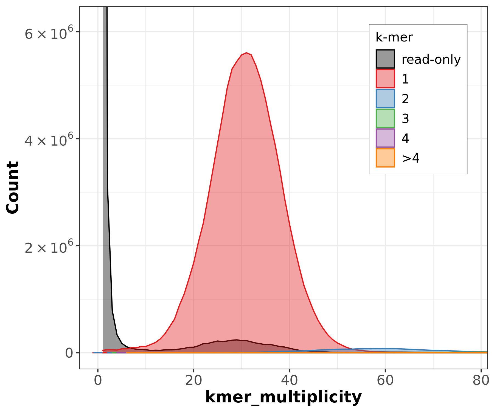

:::::::::::::::::::::::::::::::::::::: questions 

- Why is evaluating genome assembly quality important?
- What tools can be used to assess assembly completeness, accuracy, and structural integrity?
- How do you interpret key metrics from assembly evaluation tools?
- What are the main steps in evaluating a genome assembly using bioinformatics tools?


::::::::::::::::::::::::::::::::::::::::::::::::

::::::::::::::::::::::::::::::::::::: objectives

- Understand the importance of evaluating genome assembly quality.
- Learn about tools for assessing assembly completeness, accuracy, and structural integrity.
- Interpret key metrics from assembly evaluation tools to guide further analysis.
- Evaluate a genome assembly using bioinformatics tools such as QUAST, Compleasm, Merqury, and Bandage.

::::::::::::::::::::::::::::::::::::::::::::::::

## Evaluating Assembly Quality  

Assessing genome assembly quality is essential to ensure completeness, accuracy, and structural integrity before downstream analyses. Different tools provide complementary insights—**QUAST** evaluates assembly contiguity, **Compleasm** assesses gene-space completeness, **Merqury** validates k-mer consistency, and **Bandage** visualizes assembly graphs for structural assessment. Together, these methods help identify errors, improve genome reconstruction, and ensure high-quality results.  

**Why is Assembly Evaluation Important?**  

- **Detects misassemblies and structural errors**: Identifies fragmented, misjoined, or incorrectly placed contigs that can impact genome interpretation.  
- **Measures completeness and accuracy**: Ensures that essential genes and expected genome regions are properly assembled and not missing or duplicated.  
- **Validates sequencing data quality**: Confirms whether sequencing errors, biases, or artifacts affect the final assembly.  
- **Guides further refinement**: Helps decide whether additional polishing, scaffolding, or reassembly is needed for better genome reconstruction.  


## Quast for quality metrics

You can run `quast` to evaluate the quality of your genome assembly. It is also useful for comparing multiple assemblies to identify the best one based on key metrics such as contig count, N50, and misassemblies.


```bash
ml --force purge
ml biocontainers
ml quast
mkdir -p quast_evaluation
# Link your assemblies to a common directory for comparison
mkdir -p all_assemblies
# PacBio HiFi assemblies
ln -sf ../02_pacbio-hifi/hifiasm_default/At_hifiasm_default.asm.bp.p_ctg.fasta all_assemblies/hifiasm_default.fasta
ln -sf ../02_pacbio-hifi/flye_hifi/assembly.fasta all_assemblies/flye_hifi.fasta
# ONT assemblies
ln -sf ../03_ont-assembly/flye_ont/assembly.fasta all_assemblies/flye_ont.fasta
ln -sf ../03_ont-assembly/hifiasm_ont/At_hifiasm_ont.asm.bp.p_ctg.fasta all_assemblies/hifiasm_ont.fasta
# Hybrid assembly
ln -sf ../04_hybrid-assembly/hybrid_flye_out/assembly.fasta all_assemblies/hybrid_flye.fasta
# Bionano scaffolded assemblies
ln -sf ../05_scaffolding/hifiasm_bionano_scaffolded.fasta all_assemblies/hifiasm_bionano.fasta
ln -sf ../05_scaffolding/flye_bionano_scaffolded.fasta all_assemblies/flye_bionano.fasta
# Download the reference genome
wget -q -O TAIR10_reference.fasta.gz \
   "https://ftp.ensemblgenomes.org/pub/plants/release-57/fasta/arabidopsis_thaliana/dna/Arabidopsis_thaliana.TAIR10.dna.toplevel.fa.gz"
gunzip TAIR10_reference.fasta.gz
quast.py \
   --output-dir quast_comparison \
   --min-contig 3000 \
   -r TAIR10_reference.fasta \
   --threads ${SLURM_CPUS_PER_TASK} \
   --eukaryote \
   --pacbio ../01_data-qc/At_pacbio-hifi-filtered.fastq \
   all_assemblies/*.fasta
```

This will generate a detailed report in the `quast_comparison` directory, including key metrics for each assembly and a summary of their quality. You can use this information to compare different assemblies and select the best one for downstream analysis.

::: callout

## Viewing QUAST reports

Open `quast_comparison/report.html` in your browser for an interactive QUAST report with sortable tables and plots. The Icarus viewer (`icarus.html`) provides a visual alignment of your contigs against the TAIR10 reference chromosomes.

:::

:::::::::::::::::::::::::::::::::::::::::: spoiler

### Expected QUAST comparison results (vs TAIR10 reference)

| Metric | flye_bionano | flye_hifi | flye_ont | hifiasm_bionano | hifiasm_default | hifiasm_ont | hybrid_flye |
|--------|---:|---:|---:|---:|---:|---:|---:|
| # Contigs | 42 | 83 | 50 | 153 | 146 | 105 | 333 |
| Total length (Mb) | 128.97 | 133.68 | 128.74 | 143.79 | 135.75 | 127.42 | 121.11 |
| N50 (Mb) | 15.52 | 5.97 | 11.82 | 14.05 | 7.98 | 11.34 | 4.06 |
| L50 | 4 | 8 | 5 | 5 | 7 | 6 | 9 |
| auN (Mb) | 13.77 | 5.64 | 10.68 | 10.87 | 7.70 | 8.70 | 4.58 |
| Genome fraction (%) | 99.41 | 90.47 | 99.43 | 86.71 | 86.68 | 95.58 | 90.76 |
| # Misassemblies | 198 | 484 | 183 | 836 | 824 | 59 | 480 |
| Mismatches/100kbp | 26.71 | 707.09 | 26.76 | 695.76 | 660.03 | 65.99 | 702.30 |
| Indels/100kbp | 20.77 | 113.17 | 20.77 | 111.45 | 111.66 | 38.96 | 115.37 |
| N's per 100kbp | 177.79 | 0.00 | 0.00 | 5593.53 | 0.00 | 0.00 | 0.00 |
| Avg. coverage depth | 67x | 45x | 67x | 60x | 63x | 86x | 60x |

Key observations:
- **Best contiguity**: flye_bionano (N50=15.52 Mb, only 42 contigs)
- **Best genome fraction**: flye_ont (99.43%) and flye_bionano (99.41%)
- **Fewest misassemblies**: hifiasm_ont (59), far fewer than any other assembly
- **Best base accuracy**: Flye-based ONT assemblies (26.7 mismatches/100kbp) vs HiFi-based (~660-707 mismatches/100kbp) — this counterintuitive result is because QUAST aligns to TAIR10 and HiFi assemblies retain haplotypic variants that score as "mismatches"
- **N's only in Bionano-scaffolded assemblies**: gaps introduced during scaffolding

::::::::::::::::::::::::::::::::::::::::::::::::::


## Compleasm for genome completeness (gene-space)

Similarly, you can use `compleasm` to assess the completeness of your genome assembly in terms of gene-space representation. This tool compares the assembly against a set of conserved genes to estimate the level of completeness and identify missing or fragmented genes.


```bash
ml --force purge
ml biocontainers
ml compleasm
mkdir -p compleasm_evaluation
cd compleasm_evaluation
# Use the same assemblies linked in the all_assemblies directory
for fasta in ../all_assemblies/*.fasta; do
  compleasm run \
    -a ${fasta} \
    -o ${fasta%.*}_out \
    -l brassicales_odb10  \
    -t ${SLURM_CPUS_PER_TASK}
done
```

This will generate a detailed report for each assembly in the  directory, highlighting the completeness of conserved genes and potential gaps in the genome reconstruction.
The assessment result by compleasm is saved in the file `summary.txt` in the `compleasm_evaluation/assemblyN_out` (specified in output `-o` option) folder. These BUSCO genes are categorized into the following classes:

- `S` (Single Copy Complete Genes): The BUSCO genes that can be entirely aligned in the assembly, with only one copy present.
- `D` (Duplicated Complete Genes): The BUSCO genes that can be completely aligned in the assembly, with more than one copy present.
- `F` (Fragmented Genes, subclass 1): The BUSCO genes which only a portion of the gene is present in the assembly, and the rest of the gene cannot be aligned.
- `I` (Fragmented Genes, subclass 2): The BUSCO genes in which a section of the gene aligns to one position in the assembly, while the remaining part aligns to another position.
- `M` (Missing Genes): The BUSCO genes with no alignment present in the assembly.

:::::::::::::::::::::::::::::::::::::::::: spoiler

### Expected Compleasm results (brassicales_odb10)

| Assembly | Single (S) | Duplicated (D) | Fragmented (F) | Missing (M) |
|----------|---:|---:|---:|---:|
| flye_bionano | 98.93% | 1.07% | 0.00% | 0.00% |
| flye_hifi | 98.89% | 1.04% | 0.02% | 0.04% |
| flye_ont | 98.93% | 1.07% | 0.00% | 0.00% |
| hifiasm_bionano | 95.97% | 1.09% | 0.02% | 2.92% |
| hifiasm_default | 95.97% | 1.11% | 0.02% | 2.89% |
| hifiasm_ont | 98.61% | 1.04% | 0.00% | 0.35% |
| hybrid_flye | 98.50% | 1.41% | 0.02% | 0.07% |

Key observations:
- **Best completeness**: flye_bionano and flye_ont (98.93% single, 0% missing)
- **HiFiasm default has ~3% missing genes**: This is due to aggressive purging (`-l 3`), which removes some legitimate single-copy regions along with haplotigs
- **Bionano scaffolding does not change BUSCO scores**: hifiasm_default and hifiasm_bionano have identical completeness, confirming scaffolding only reorders contigs

::::::::::::::::::::::::::::::::::::::::::::::::::


## Merqury for evaluating genome assembly

Merqury is a tool for reference-free assembly evaluation based on efficient k-mer set operations. It provides insights into various aspects of genome assembly, offering a comprehensive view of genome quality without relying on a reference sequence. Specifically, Merqury can generate the following plots and metrics:

- **Copy Number Spectrum (Spectra-cn Plot):**  
  - A **k-mer-based analysis** that detects heterozygosity levels and genome repeats by identifying peaks in k-mer coverage.  
  - Helps estimate genome size, detect missing regions, and distinguish between homozygous and heterozygous k-mers in an assembly.  

- **Assembly Spectrum (Spectra-asm Plot):**  
  - Compares k-mers between different assemblies or between an assembly and raw sequencing reads.  
  - Useful for detecting missing sequences, shared regions, and assembly-specific k-mers that may indicate errors or haplotype-specific variations.  

- **K-mer Completeness:**  
  - Measures how many **reliable k-mers** (those likely to be real and not sequencing errors) are present in both the sequencing reads and the assembly.  
  - Helps identify missing regions, misassemblies, and sequencing biases affecting genome reconstruction.  

- **Consensus Quality (QV) Estimation:**  
  - Uses **k-mer agreement between the assembly and the read set** to estimate base-level accuracy.  
  - Higher QV scores indicate a more accurate consensus sequence, but results depend on read quality and coverage depth.  

- **Misassembly Detection with K-mer Positioning:**  
  - Identifies **unexpected k-mers** or **false duplications** in assemblies, reporting their positions in `.bed` and `.tdf` files for visualization in genome browsers.  
  - Helps pinpoint structural errors such as collapsed repeats, chimeric joins, or large insertions/deletions.  

This **k-mer-based approach** in Merqury provides **reference-free genome quality evaluation**, making it highly effective for **de novo assemblies and structural validation**.


```bash
ml --force purge
ml biocontainers
ml merqury
ml meryl
mkdir -p merqury_evaluation
cd merqury_evaluation
# Step 1: Build a meryl k-mer database from the filtered HiFi reads
meryl \
   count k=21 \
   threads=${SLURM_CPUS_PER_TASK} \
   memory=8g \
   output reads.meryl \
   ../../01_data-qc/At_pacbio-hifi-filtered.fastq
# Step 2: Run merqury to evaluate assemblies
# Syntax: merqury.sh <read-db.meryl> <asm1.fasta> [asm2.fasta] <output_prefix>
# For a single assembly:
merqury.sh \
   reads.meryl \
   ../../02_pacbio-hifi/hifiasm_default/At_hifiasm_default.asm.bp.p_ctg.fasta \
   merqury_hifiasm
# For comparing multiple assemblies:
merqury.sh \
   reads.meryl \
   ../../02_pacbio-hifi/hifiasm_default/At_hifiasm_default.asm.bp.p_ctg.fasta \
   ../../03_ont-assembly/flye_ont/assembly.fasta \
   merqury_comparison
```

::: callout

## Merqury syntax

Note that `merqury.sh` uses **positional arguments** (not flags):

```
merqury.sh <read-db.meryl> <assembly1.fasta> [assembly2.fasta] <output_prefix>
```

The output prefix determines the names of all generated files. When comparing two assemblies, provide both FASTA files before the output prefix.

:::

This will generate numerous files with the specified output prefix, including k-mer spectra plots, completeness metrics, and consensus quality (QV) estimates for each assembly. You can use these results to evaluate the accuracy, completeness, and structural integrity of your genome assemblies.

:::::::::::::::::::::::::::::::::::::::::: spoiler

### Expected Merqury results

**For the hifiasm_bionano assembly:**

| Metric | Value |
|--------|------:|
| Consensus Quality (QV) | 62.91 |
| Error rate | 5.11 x 10^-7 |
| K-mer completeness | 95.73% |
| K-mers found | 104,602,794 / 109,271,894 |

A QV of 62.91 corresponds to approximately 1 error per ~2 million bases, indicating extremely high base-level accuracy. The k-mer completeness of 95.73% means nearly all reliable k-mers from the reads are represented in the assembly.

**Interpreting Merqury output files:**
- `merqury_out.qv`: Assembly name, error k-mers, total k-mers, QV score, error rate
- `merqury_out.completeness.stats`: Assembly name, set type, found k-mers, total k-mers, completeness %
- `merqury_out.spectra-cn.*.png`: Copy number spectrum plot
- `merqury_out.spectra-asm.*.png`: Assembly spectrum plot

{alt="Merqury copy number spectrum plot for the hifiasm Bionano-scaffolded assembly showing a sharp unimodal peak at approximately 30x indicating a homozygous genome with high completeness"}

{alt="Merqury assembly spectrum plot comparing k-mers found in the assembly versus read-only k-mers showing most k-mers are shared between reads and assembly"}

::::::::::::::::::::::::::::::::::::::::::::::::::


## Assembly graph visualization using Bandage

Bandage is a tool for visualizing assembly graphs, which represent the connections between contigs or scaffolds in a genome assembly. By visualizing the graph structure, you can identify complex regions, repetitive elements, and potential misassemblies that may affect the genome reconstruction.


To visualize the assembly graph using Bandage:

1. Open a web browser and navigate to [desktop.negishi.rcac.purdue.edu]().
2. Log in with your Purdue Career Account username and password, but append ",push" to your password.
3. Launch the terminal and run the following command:

```bash
ml --force purge
ml biocontainers
ml bandage
Bandage
```

4. In the Bandage interface, navigate to your assembly folder and load your assembly graph in GFA format (e.g., `../02_pacbio-hifi/hifiasm_default/At_hifiasm_default.asm.bp.p_ctg.gfa` for hifiasm, or `../03_ont-assembly/flye_ont/assembly_graph.gfa` for Flye).
5. Explore the graph structure, identify complex regions, and visualize connections between contigs or scaffolds.

::: callout

## Bandage input format

Bandage requires assembly **graph** files (`.gfa` format), not FASTA files. HiFiasm outputs `.gfa` files directly, while Flye produces `assembly_graph.gfa` in its output directory.

:::

{alt="Screenshot of the Bandage application showing an assembly graph visualization with connected contigs"}


## Unified Assembly Comparison

After running all evaluation tools, compile your results into a summary table to compare assemblies side by side:

| Metric | HiFiasm (HiFi) | Flye (HiFi) | Flye (ONT) | HiFiasm (ONT) | Hybrid (Flye) | HiFiasm + Bionano | Flye + Bionano |
|--------|---:|---:|---:|---:|---:|---:|---:|
| # Contigs | 146 | 83 | 50 | 105 | 333 | 153 | 42 |
| Total size (Mb) | 135.75 | 133.68 | 128.74 | 127.42 | 121.11 | 143.79 | 128.97 |
| N50 (Mb) | 7.98 | 5.97 | 11.82 | 11.34 | 4.06 | 14.05 | 15.52 |
| L50 | 7 | 8 | 5 | 6 | 9 | 5 | 4 |
| BUSCO Complete (%) | 97.08 | 99.93 | 100.00 | 99.65 | 99.91 | 97.06 | 100.00 |
| BUSCO Single (%) | 95.97 | 98.89 | 98.93 | 98.61 | 98.50 | 95.97 | 98.93 |
| BUSCO Duplicated (%) | 1.11 | 1.04 | 1.07 | 1.04 | 1.41 | 1.09 | 1.07 |
| Genome fraction (%) | 86.68 | 90.47 | 99.43 | 95.58 | 90.76 | 86.71 | 99.41 |
| Misassemblies | 824 | 484 | 183 | 59 | 480 | 836 | 198 |
| Merqury QV | — | — | — | — | — | 62.91 | — |
| K-mer completeness (%) | — | — | — | — | — | 95.73 | — |

::: callout

## Interpreting your results

When comparing assemblies, consider these questions:

1. Which assembly has the highest N50 and lowest number of contigs?
2. Which assembly has the best BUSCO completeness?
3. How do the Merqury QV scores compare? (Higher QV = fewer base-level errors)
4. Did Bionano scaffolding improve contiguity (N50) compared to the unscaffolded assemblies?
5. Is the total assembly size close to the expected genome size (~135 Mb for _A. thaliana_)?

Fill in the table above with your actual results and discuss which assembly strategy produced the best outcome for this dataset.

:::

::::::::::::::::::::::::::::::::::::: keypoints


- **QUAST** evaluates assembly contiguity and quality metrics.
- **Compleasm** assesses gene-space completeness in genome assemblies.
- **Merqury** provides reference-free evaluation based on k-mer analysis.
- **Bandage** visualizes assembly graphs for structural assessment.

::::::::::::::::::::::::::::::::::::::::::::::::


