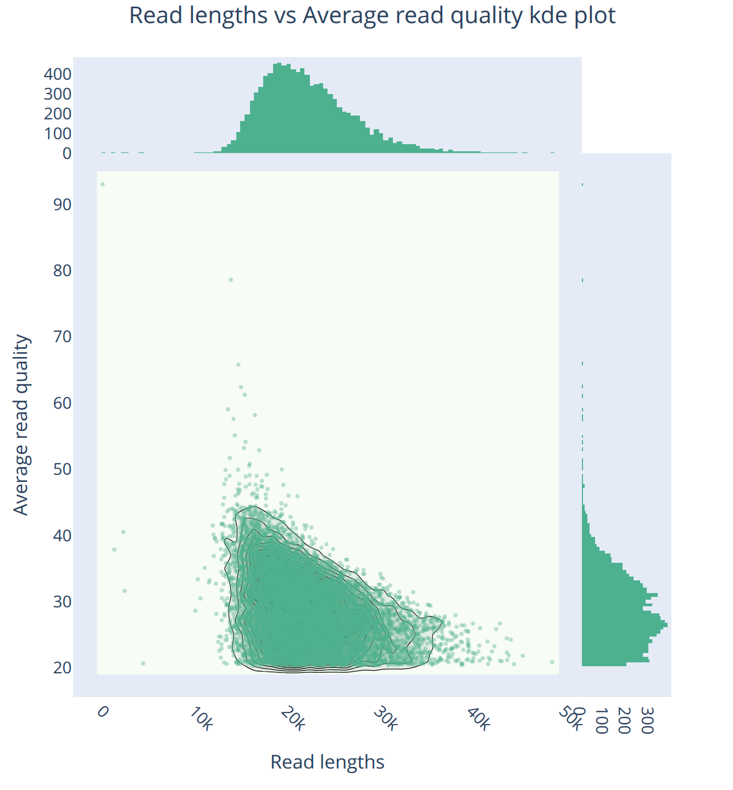

:::::::::::::::::::::::::::::::::::::: questions 

- What is data quality checking and filtering?
- Why is it necessary to assess the quality of raw sequencing data?
- What are the key steps in filtering long-read sequencing data?
- How can visualization tools like NanoPlot help in quality assessment?

::::::::::::::::::::::::::::::::::::::::::::::::

::::::::::::::::::::::::::::::::::::: objectives

- Understand the importance of data quality checking and filtering in genome assembly.
- Learn how to assess raw sequencing data quality using NanoPlot.
- Gain hands-on experience in filtering long-read sequencing data with Filtlong.
- Evaluate the impact of filtering on data quality using NanoPlot.
- Explore k-mer analysis for quality assessment (optional).

::::::::::::::::::::::::::::::::::::::::::::::::


## Data Quality Check and Filtering  

- **What is data quality checking and filtering?**
  - Assessing the quality of raw sequencing data before genome assembly.
  - Identifying and removing low-quality or problematic reads before assembly.  
  - Ensuring that the data is suitable for downstream analysis.
  - Better quality ingredients make a better quality cake!  

- **Why is it necessary?**
  - Poor quality data can lead to errors in genome assembly.
  - Low-quality reads can introduce gaps, misassemblies, or incorrect base calls.
  - Filtering out low-quality reads can improve the accuracy and efficiency of assembly.
  - It is a critical step to ensure the success of downstream analyses.

- **What we will do today?**
  - Learn the process of long-read generation (PacBio HiFi and ONT) - a brief overview.
  - Assess raw data quality using `NanoPlot` for PacBio HiFi and ONT reads - hands-on.  
  - Filter reads based on quality and length using `Filtlong` - hands-on.
  - Re-evaluate data post-filtering using `NanoPlot` to confirm improvements - hands-on.  
  - K-mer analysis to ensure data quality (optional hands-on). 


{alt="Flowchart showing data quality control steps: NanoPlot assessment, Filtlong filtering, and post-filtering evaluation"}


## PacBio HiFi reads from Subreads

**PacBio HiFi** reads can be generated using [Circular Consensus Sequencing](https://ccs.how/) (CCS) program from **PacBio**

- PacBio circular consensus sequencing (CCS) generates HiFi reads by sequencing the same DNA molecule multiple times  
- The more passes over the same molecule, the higher the consensus accuracy  
- Two main stages:  
  - Generate a draft consensus from multiple subreads  
  - Iteratively polish the consensus using all subreads to refine accuracy  

{alt="Diagram showing PacBio circular consensus sequencing generating HiFi reads from multiple passes"}

**What does CCS do?**

1. Filter low-quality subreads based on length and signal-to-noise ratio  
2. Generate an initial consensus using overlapping subreads  
3. Align all subreads to the draft consensus for refinement  
4. Divide sequence into small overlapping windows to optimize polishing  
5. Identify and correct errors, heteroduplex artifacts, and large insertions  
6. Apply polishing algorithms to refine the sequence, removing ambiguities  
7. Compute read accuracy based on error likelihood  
8. Output the final HiFi read if accuracy meets the threshold  

**Why is this important?**  

- Produces highly accurate long reads (99 percent or higher)  
- Enables better genome assembly, especially in complex or repetitive regions  
- Reduces the need for additional error correction  

**How was the data generated?**

Subreads (in bam format) were converted to ccs fastq as follows:

```bash
ccs \
   --hifi-kinetics \
   --num-threads $SLURM_CPUS_PER_TASK \
   input.subreads.bam \
   output.hifi.bam
samtools fastq \
   output.hifi.bam > output.hifi.fastq
```

**What is the source of this data?**

- The PacBio HiFi reads are from the project [PRJEB50694](https://www.ebi.ac.uk/ena/browser/view/PRJEB50694).
- Data is for _Arabidopsis thaliana_ ecotype Col-0, sequenced using PacBio HiFi technology (they also sequenced CLR data for this project).
- The data is publicly available on the European Nucleotide Archive (ENA), and the `9994.q20.CCS.fastq.gz` reads were used for analysis.
- Data has been filtered to include only HiFi reads with a Q-score of 20 or higher.


## ONT Reads from MinION Sequencing

**Oxford Nanopore Technologies (ONT)** sequencing generates long reads by passing DNA through a biological nanopore

   - ONT reads are generated in real-time as the DNA strand moves through the nanopore.
   - Dorado is Oxford Nanopore Technologies’ basecaller that converts raw electrical signals from nanopores into nucleotide sequences using machine learning.  


{alt="Diagram showing Oxford Nanopore read generation from signal detection through Dorado basecalling"}


**Key steps in `dorado` base calling**

1. **Signal detection**  
   - DNA or RNA molecules pass through a nanopore, disrupting an electrical current.  
   - These disruptions create a unique signal pattern called a **squiggle**.  

2. **Real-time data processing**  
   - The MinKNOW software captures and processes the squiggle into sequencing reads.  
   - Reads include standard nucleotides and potential base modifications like methylation.  

3. **Basecalling with machine learning**  
   - Neural networks, including transformer models, predict the nucleotide sequence from raw signals.  
   - Models continuously improve by training on diverse sequencing data.  

4. **Error correction and refinement**  
   - Dorado refines base predictions to reduce errors, especially in homopolymer regions.  
   - Models are optimized for accuracy across various DNA/RNA types.  

5. **High-speed processing**  
   - Basecalling can be performed **during sequencing** for real-time analysis or **after sequencing** for higher accuracy.  
   - GPUs accelerate computation, enabling rapid basecalling and simultaneous modification detection.  

**Why this matters**

- Enables **real-time sequencing and analysis** for quick decision-making.  
- Uses **advanced machine learning** to improve sequence accuracy over time.  
- Supports **epigenetic modification detection** without extra processing steps.  


**How was the data generated?**

`pod5` ONT reads were basecalled using Dorado as follows:

```bash
# download
wget ftp.sra.ebi.ac.uk/vol1/run/ERR791/ERR7919757/Arabidopsis-pass.tar.gz
# extract
tar -xvf Arabidopsis-pass.tar.gz # fast5_pass is the extracted directory 
# convert to pod5 format
pod5 convert \
   fast5 fast5_pass --output pod5_pass
# download model
dorado download \
   --model "dna_r10.4.1_e8.2_400bps_hac@v3.5.2" \
   --models-directory models_dir/
# basecall
dorado basecaller \
   --emit-fastq \
   --output-dir dorado_output_dir \
   models_dir/dna_r10.4.1_e8.2_400bps_hac@v3.5.2 \
   input_pass.pod5
```

**What is the source of this data?**

- The ONT reads are from the project [PRJEB49840](https://www.ebi.ac.uk/ena/browser/view/PRJEB49840). 
- Data is for _Arabidopsis thaliana_ ecotype Col-0, sequenced using R10.4/Q20+ chemistry from MinION cell
- The data is publicly available on the European Nucleotide Archive (ENA), and the `pass_fast5` reads were used for basecalling (with commands above).

## SLURM Job Script Template

Throughout this workshop, you will need to submit jobs to the cluster using SLURM. Here is a template SLURM script that you can adapt for each step:

```bash
#!/bin/bash
#SBATCH --nodes=1
#SBATCH --ntasks=1
#SBATCH --cpus-per-task=8
#SBATCH --account=rcac-rnaseq
#SBATCH --partition=cpu
#SBATCH --qos=normal
#SBATCH --time=08:00:00
#SBATCH --job-name=genome-assembly
#SBATCH --output=negishi-%x.%j.out
#SBATCH --error=negishi-%x.%j.err

# Load modules
ml --force purge
ml biocontainers

# Your commands go here
```

::: callout

## Submitting and monitoring jobs

- Save the script as `job_script.sh` and submit with `sbatch job_script.sh`
- Monitor with `squeue -u $USER`
- Check output in the `.out` and `.err` files
- Adjust `--cpus-per-task`, `--time`, and `--mem` based on the tool requirements (see the Resource Requirements table in the Assembly Strategies episode)

:::


## A. NanoPlot for Quality Assessment

[NanoPlot](https://github.com/wdecoster/NanoPlot) [ref](https://doi.org/10.1093/bioinformatics/bty149) is a visualization tool designed for quality assessment of long-read sequencing data. It generates a variety of plots, including read length histograms, cumulative yield plots, violin plots of read length and quality over time, and bivariate plots that compare read lengths, quality scores, reference identity, and mapping quality. By providing both single-variable and density-based visualizations, NanoPlot helps users quickly assess sequencing run quality and detect potential issues. The tool also allows downsampling, length and quality filtering, and barcode-specific analysis for multiplexed experiments.

**1. Quality Assessment of PacBio HiFi Reads**  

Assessing the quality of PacBio HiFi reads using `NanoPlot`. Create a SLURM script to run NanoPlot on the HiFi reads.

```bash
ml --force purge
ml biocontainers
ml nanoplot
NanoPlot \
   --threads ${SLURM_CPUS_PER_TASK} \
   --verbose \
   --outdir nanoplot_pacbio_pre \
   --prefix At_PacBio_ \
   --plots kde \
   --N50 \
   --dpi 300 \
   --fastq ../00_rawdata/At_pacbio-hifi.fastq.gz
```


:::::::::::::::::::::::::::::::::::::::::: spoiler

The stdout from the NanoPlot run will look like this:

```
2025-02-13 12:13:19,155 NanoPlot 1.44.1 started with arguments Namespace(threads=16, verbose=True, store=False, raw=False, huge=False, outdir='nanoplot_pacbio_pre', no_static=False, prefix='At_PacBio_', tsv_stats=False, only_report=False, info_in_report=False, maxlength=None, minlength=None, drop_outliers=False, downsample=None, loglength=False, percentqual=False, alength=False, minqual=None, runtime_until=None, barcoded=False, no_supplementary=False, color='#4CB391', colormap='Greens', format=['png'], plots=['kde'], legacy=None, listcolors=False, listcolormaps=False, no_N50=False, N50=True, title=None, font_scale=1, dpi=300, hide_stats=False, fastq=['At_pacbio-hifi.fastq.gz'], fasta=None, fastq_rich=None, fastq_minimal=None, summary=None, bam=None, ubam=None, cram=None, pickle=None, feather=None, path='nanoplot_pacbio_pre/At_PacBio_')
2025-02-13 12:13:19,156 Python version is: 3.9.21 | packaged by conda-forge | (main, Dec  5 2024, 13:51:40)  [GCC 13.3.0]
2025-02-13 12:13:19,186 Nanoget: Starting to collect statistics from plain fastq file.
2025-02-13 12:13:19,187 Nanoget: Decompressing gzipped fastq At_pacbio-hifi.fastq.gz
2025-02-13 12:29:10,170 Reduced DataFrame memory usage from 12.780670166015625Mb to 12.780670166015625Mb
2025-02-13 12:29:10,194 Nanoget: Gathered all metrics of 837586 reads
2025-02-13 12:29:10,538 Calculated statistics
2025-02-13 12:29:10,539 Using sequenced read lengths for plotting.
2025-02-13 12:29:10,556 NanoPlot:  Valid color #4CB391.
2025-02-13 12:29:10,557 NanoPlot:  Valid colormap Greens.
2025-02-13 12:29:10,582 NanoPlot:  Creating length plots for Read length.
2025-02-13 12:29:10,583 NanoPlot: Using 837586 reads with read length N50 of 22587bp and maximum of 57055bp.
2025-02-13 12:29:11,933 Saved nanoplot_pacbio_pre/At_PacBio_WeightedHistogramReadlength  as png (or png for --legacy)
2025-02-13 12:29:12,443 Saved nanoplot_pacbio_pre/At_PacBio_WeightedLogTransformed_HistogramReadlength  as png (or png for --legacy)
2025-02-13 12:29:12,899 Saved nanoplot_pacbio_pre/At_PacBio_Non_weightedHistogramReadlength  as png (or png for --legacy)
2025-02-13 12:29:13,371 Saved nanoplot_pacbio_pre/At_PacBio_Non_weightedLogTransformed_HistogramReadlength  as png (or png for --legacy)
2025-02-13 12:29:13,372 NanoPlot: Creating yield by minimal length plot for Read length.
2025-02-13 12:29:14,465 Saved nanoplot_pacbio_pre/At_PacBio_Yield_By_Length  as png (or png for --legacy)
2025-02-13 12:29:14,466 Created length plots
2025-02-13 12:29:14,474 NanoPlot: Creating Read lengths vs Average read quality plots using 837586 reads.
2025-02-13 12:29:15,012 Saved nanoplot_pacbio_pre/At_PacBio_LengthvsQualityScatterPlot_kde  as png (or png for --legacy)
2025-02-13 12:29:15,013 Created LengthvsQual plot
2025-02-13 12:29:15,013 Writing html report.
2025-02-13 12:29:15,029 Finished!

```
::::::::::::::::::::::::::::::::::::::::::::::::::

**Evaluate the quality of HiFi reads:**

Examine the `At_PacBio_NanoPlot-report.html` file

- **Read length distribution**: Histogram of read lengths, showing the distribution of read lengths in the dataset.
- **Read length vs. Quality**: Scatter plot showing the relationship between read length and quality score.
- **Yield (number of bases) by read length**: Plot showing the cumulative yield of reads based on their length.
- **Log-Transformed histograms**: Histogram of read lengths with a log-transformed scale for better visualization.
- **KDE plots**: Kernel Density Estimation plots for read length and quality score distributions.
- **Summary statistics**: N50 value, maximum read length, and other key metrics.

:::::::::::::::::::::::::::::::::::::::::: spoiler

### Expected NanoPlot scatter plot for PacBio HiFi reads

{alt="KDE scatter plot of PacBio HiFi read length versus average read quality showing a tight cluster of reads between 15-30 kb with quality scores predominantly above Q20"}

::::::::::::::::::::::::::::::::::::::::::::::::::

:::::::::::::::::::::::::::::::::::::::::: spoiler

### Expected NanoStats for PacBio HiFi reads

| Metric | Value |
|--------|-------|
| Number of reads | 837,586 |
| Total bases | 18,636,790,429 (~18.6 Gb) |
| Mean read length | 22,250.6 |
| Median read length | 21,506.0 |
| Read length N50 | 22,587 |
| Mean read quality | 26.3 |
| Median read quality | 28.4 |
| Reads >Q10 | 837,586 (100.0%) |
| Reads >Q20 | 837,586 (100.0%) |
| Reads >Q30 | 333,658 (39.8%) |

::::::::::::::::::::::::::::::::::::::::::::::::::

::: callout

**What filtering should be applied to the PacBio HiFi reads based on the quality assessment?**

Our genome (_A. thaliana_) has a genome size of ~135 Mb. Our target coverage is ~40x. Currently we have ~18Gb of HiFi reads (~138X depth of coverage). We need to filter the reads to ensure we have good quality reads of desired length and coverage.
:::

**2. Quality Assessment of ONT Reads**  

Assessing the quality of ONT reads using `NanoPlot`. Create a slurm script to run NanoPlot on the basecalled ONT reads.

```bash
ml --force purge
ml biocontainers
ml nanoplot
NanoPlot \
   --threads ${SLURM_CPUS_PER_TASK} \
   --verbose \
   --outdir nanoplot_ont_pre \
   --prefix At_ONT_ \
   --plots kde \
   --N50 \
   --dpi 300 \
   --fastq ../00_rawdata/At_ont-reads.fastq.gz
```

:::::::::::::::::::::::::::::::::::::::::: spoiler

The stdout from the NanoPlot run will look like this:

```
2025-02-13 12:15:51,066 NanoPlot 1.44.1 started with arguments Namespace(threads=8, verbose=True, store=False, raw=False, huge=False, outdir='nanoplot_ont_pre', no_static=False, prefix='At_ONT_', tsv_stats=False, only_report=False, info_in_report=False, maxlength=None, minlength=None, drop_outliers=False, downsample=None, loglength=False, percentqual=False, alength=False, minqual=None, runtime_until=None, barcoded=False, no_supplementary=False, color='#4CB391', colormap='Greens', format=['png'], plots=['kde'], legacy=None, listcolors=False, listcolormaps=False, no_N50=False, N50=True, title=None, font_scale=1, dpi=300, hide_stats=False, fastq=['At_ont-reads.fastq.gz'], fasta=None, fastq_rich=None, fastq_minimal=None, summary=None, bam=None, ubam=None, cram=None, pickle=None, feather=None, path='nanoplot_ont_pre/At_ONT_')
2025-02-13 12:15:51,067 Python version is: 3.9.21 | packaged by conda-forge | (main, Dec  5 2024, 13:51:40)  [GCC 13.3.0]
2025-02-13 12:15:51,096 Nanoget: Starting to collect statistics from plain fastq file.
2025-02-13 12:25:11,429 Reduced DataFrame memory usage from 8.842315673828125Mb to 8.842315673828125Mb
2025-02-13 12:25:11,455 Nanoget: Gathered all metrics of 579482 reads
2025-02-13 12:25:11,692 Calculated statistics
2025-02-13 12:25:11,693 Using sequenced read lengths for plotting.
2025-02-13 12:25:11,707 NanoPlot:  Valid color #4CB391.
2025-02-13 12:25:11,707 NanoPlot:  Valid colormap Greens.
2025-02-13 12:25:11,725 NanoPlot:  Creating length plots for Read length.
2025-02-13 12:25:11,725 NanoPlot: Using 579482 reads with read length N50 of 36292bp and maximum of 298974bp.
2025-02-13 12:25:13,096 Saved nanoplot_ont_pre/At_ONT_WeightedHistogramReadlength  as png (or png for --legacy)
2025-02-13 12:25:13,571 Saved nanoplot_ont_pre/At_ONT_WeightedLogTransformed_HistogramReadlength  as png (or png for --legacy)
2025-02-13 12:25:14,971 Saved nanoplot_ont_pre/At_ONT_Non_weightedHistogramReadlength  as png (or png for --legacy)
2025-02-13 12:25:15,440 Saved nanoplot_ont_pre/At_ONT_Non_weightedLogTransformed_HistogramReadlength  as png (or png for --legacy)
2025-02-13 12:25:15,441 NanoPlot: Creating yield by minimal length plot for Read length.
2025-02-13 12:25:16,485 Saved nanoplot_ont_pre/At_ONT_Yield_By_Length  as png (or png for --legacy)
2025-02-13 12:25:16,486 Created length plots
2025-02-13 12:25:16,495 NanoPlot: Creating Read lengths vs Average read quality plots using 579482 reads.
2025-02-13 12:25:17,029 Saved nanoplot_ont_pre/At_ONT_LengthvsQualityScatterPlot_kde  as png (or png for --legacy)
2025-02-13 12:25:17,030 Created LengthvsQual plot
2025-02-13 12:25:17,030 Writing html report.
2025-02-13 12:25:17,047 Finished!
```
::::::::::::::::::::::::::::::::::::::::::::::::::

**Evaluate the quality of ONT reads:**

Examine the `At_ONT_NanoPlot-report.html` file. 

- **Read length distribution**: Histogram of read lengths, showing the distribution of read lengths in the dataset.
- **Read length vs. Quality**: Scatter plot showing the relationship between read length and quality score.
- **Yield (number of bases) by read length**: Plot showing the cumulative yield of reads based on their length.
- **Log-Transformed histograms**: Histogram of read lengths with a log-transformed scale for better visualization.
- **KDE plots**: Kernel Density Estimation plots for read length and quality score distributions.
- **Summary statistics**: N50 value, maximum read length, and other key metrics.

:::::::::::::::::::::::::::::::::::::::::: spoiler

### Expected NanoPlot scatter plot for ONT reads

{alt="KDE scatter plot of ONT read length versus average read quality showing a broad spread of reads from 1-200 kb with quality scores ranging from Q5 to Q20"}

::::::::::::::::::::::::::::::::::::::::::::::::::

:::::::::::::::::::::::::::::::::::::::::: spoiler

### Expected NanoStats for ONT reads

| Metric | Value |
|--------|-------|
| Number of reads | 579,482 |
| Total bases | 14,055,262,695 (~14.1 Gb) |
| Mean read length | 24,254.9 |
| Median read length | 22,554.0 |
| Read length N50 | 36,292 |
| Mean read quality | 12.1 |
| Median read quality | 13.7 |
| Reads >Q10 | 521,512 (90.0%) |
| Reads >Q15 | 176,536 (30.5%) |
| Reads >Q20 | 155 (0.0%) |
| Longest read | 298,974 bp |

::::::::::::::::::::::::::::::::::::::::::::::::::

::: callout

**What filtering should be applied to the ONT reads based on the quality assessment?**

Our genome (_A. thaliana_) has a genome size of ~135 Mb. Our target coverage is ~40x. Currently we have ~14Gb of ONT reads (104X depth of coverage). We need to filter the reads to ensure we have good quality reads of desired length and coverage.

:::


## B. Filtering Sequencing Reads


[`Filtlong`](https://github.com/rrwick/Filtlong) is a tool designed to filter long-read sequencing data by selecting a smaller, higher-quality subset of reads based on length and identity. It prioritizes longer reads with higher sequence identity while discarding shorter or lower-quality reads, ensuring that the retained data contributes to more accurate genome assemblies. This filtering step is crucial for improving assembly contiguity, reducing errors, and optimizing computational efficiency by removing excess low-quality data.


::: callout

## Note on Filtlong and HiFi reads

Filtlong was originally designed for filtering error-prone long reads (ONT, PacBio CLR) where quality variation is significant. For PacBio HiFi reads, which already have very high accuracy (~Q20+), Filtlong's quality-based filtering provides less benefit. We use it here primarily for **length filtering and downsampling** to target coverage. For HiFi-specific filtering, you could alternatively use tools like `bamtools` on the original BAM files or simply subsample by read length.

:::

**1. Filtering PacBio HiFi Reads**

Filter the PacBio HiFi reads using `Filtlong` to retain only high-quality reads.

```bash
ml --force purge
ml biocontainers
ml filtlong
filtlong \
   --target_bases 5400000000 \
   --keep_percent 90 \
   --min_length 1000 \
     ../00_rawdata/At_pacbio-hifi.fastq.gz > At_pacbio-hifi-filtered.fastq
```

**2. Filtering ONT Reads**

Filter the ONT reads using `Filtlong` to retain only high-quality reads.

```bash
ml --force purge
ml biocontainers
ml filtlong
filtlong \
   --target_bases 5400000000 \
   --keep_percent 90 \
   --min_length 1000 \
     ../00_rawdata/At_ont-reads.fastq.gz > At_ont-reads-filtered.fastq
```

::: callout

**What does this command do?**

- `--target_bases 5400000000`: Target number of bases to retain in the filtered dataset (5.4 Gb).
- `--keep_percent 90`: Retain reads that cover 90% of the target bases.
- `--min_length 1000`: Minimum read length to keep in the filtered dataset (1000 bp).

:::


## C. Evaluating Data Quality After Filtering  


We will re-run `NanoPlot` on the filtered HiFi and ONT reads to assess the quality of the filtered datasets.

**1. For PacBio HiFi Reads:**

```bash
ml --force purge
ml biocontainers
ml nanoplot
NanoPlot \
   --threads ${SLURM_CPUS_PER_TASK} \
   --verbose \
   --outdir nanoplot_pacbio_post \
   --prefix At_PacBio_post_ \
   --plots kde \
   --N50 \
   --dpi 300 \
   --fastq At_pacbio-hifi-filtered.fastq

```

**2. For ONT Reads:**

```bash
ml --force purge
ml biocontainers
ml nanoplot
NanoPlot \
   --threads ${SLURM_CPUS_PER_TASK} \
   --verbose \
   --outdir nanoplot_ont_post \
   --prefix At_ONT_post_ \
   --plots kde \
   --N50 \
   --dpi 300 \
   --fastq At_ont-reads-filtered.fastq
```

Now, examine the `At_PacBio_post_NanoPlot-report.html` and `At_ONT_post_NanoPlot-report.html` files to assess the quality of the filtered HiFi and ONT reads. Do you observe any improvements in read quality after filtering?
We will use these filtered reads for downstream genome assembly.

:::::::::::::::::::::::::::::::::::::::::: spoiler

### Expected NanoPlot: ONT reads after filtering

{alt="KDE scatter plot of ONT read length versus quality after Filtlong filtering showing reads concentrated between 20-80 kb with the shortest and lowest-quality reads removed"}

::::::::::::::::::::::::::::::::::::::::::::::::::

:::::::::::::::::::::::::::::::::::::::::: spoiler

### Expected NanoStats: before vs after filtering

| Metric | PacBio HiFi (raw) | PacBio HiFi (filtered) | ONT (raw) | ONT (filtered) |
|--------|-------------------|----------------------|-----------|----------------|
| Number of reads | 837,586 | 251,246 | 579,482 | 133,217 |
| Total bases | 18.6 Gb | 5.4 Gb | 14.1 Gb | 5.4 Gb |
| Mean read length | 22,251 | 21,493 | 24,255 | 40,535 |
| N50 read length | 22,587 | 21,636 | 36,292 | 42,129 |
| Mean quality | Q26.3 | Q33.5 | Q12.1 | Q15.3 |
| Reads >Q20 | 100.0% | 100.0% | 0.0% | 0.1% |
| Reads >Q30 | 39.8% | 95.9% | 0.0% | 0.0% |
| Coverage (~135 Mb) | ~138x | ~40x | ~104x | ~40x |

Key observations:

- **Both datasets filtered to ~40x** (5.4 Gb target), matching our assembly target
- **PacBio HiFi quality improved dramatically**: mean Q26.3 → Q33.5, and 95.9% reads now >Q30 (was 39.8%)
- **ONT read lengths increased after filtering**: mean 24 kb → 41 kb, N50 36 kb → 42 kb — Filtlong retained the longest, highest-quality reads
- **ONT quality remains below Q20**: this is expected for HAC basecalled ONT data and does not affect assembly quality with modern assemblers

::::::::::::::::::::::::::::::::::::::::::::::::::


## D. K-mer Based Quality Checks (Optional) 

[GenomeScope](https://github.com/tbenavi1/genomescope2.0) is a k-mer-based tool used to profile genomes without requiring a reference, providing estimates of genome size, heterozygosity, and repeat content. It uses k-mer frequency distributions from raw sequencing reads to model genome characteristics, making it especially useful for detecting sequencing artifacts and assessing data quality before assembly. In this optional section, we will use GenomeScope to evaluate the quality of our Oxford Nanopore and PacBio reads by identifying potential errors, biases, and coverage issues, helping to refine filtering strategies and improve downstream assembly results [ref](https://www.nature.com/articles/s41467-020-14998-3).


**1. For PacBio HiFi Reads:**


```bash
ml --force purge
ml biocontainers
ml kmc
mkdir -p tmp_pacbio
ls At_pacbio-hifi-filtered.fastq > FILES_pacbio
kmc -k21 -t10 -m64 -ci1 -cs10000 @FILES_pacbio reads_pacbio tmp_pacbio/
kmc_tools transform reads_pacbio histogram reads-pacbio.histo -cx10000
```

**2. For ONT Reads:**

```bash
ml --force purge
ml biocontainers
ml kmc
mkdir -p tmp_ont
ls At_ont-reads-filtered.fastq > FILES_ont
kmc -k21 -t10 -m64 -ci1 -cs10000 @FILES_ont reads_ont tmp_ont/
kmc_tools transform reads_ont histogram reads-ont.histo -cx10000
```

Now you can visualize the k-mer frequency distributions using GenomeScope to assess the quality of the HiFi and ONT reads. This analysis can help identify potential issues and guide further filtering or processing steps to improve data quality.

To visualize the k-mer frequency distributions, you can use the command-line version of GenomeScope2:

```bash
ml --force purge
ml biocontainers
ml genomescope2
# For PacBio HiFi reads:
genomescope2 -i reads-pacbio.histo -o genomescope_pacbio -k 21 -p 2 --name_prefix "PacBio_HiFi"
# For ONT reads:
genomescope2 -i reads-ont.histo -o genomescope_ont -k 21 -p 2 --name_prefix "Oxford_Nanopore"
```

Alternatively, you can use the [GenomeScope web interface](https://genomescope.org/genomescope2.0/) to upload the `.histo` files and generate plots interactively (note: the web server may occasionally be unavailable).

:::::::::::::::::::::::::::::::::::::::::: spoiler

### Expected GenomeScope2 results

**PacBio HiFi k-mer histogram** shows a clear unimodal peak at ~30-31x coverage, confirming the expected ~40x coverage after filtering and a homozygous genome. The histogram can be used to estimate genome size (~135 Mb) from the peak position.

**However**, GenomeScope2 may fail or produce incomplete results depending on the input:

- **PacBio HiFi**: GenomeScope2 may only show "starting" in its progress file without producing a model. This can happen when the k-mer distribution is too clean (very low error rate in HiFi reads) for GenomeScope's error model.
- **ONT reads**: GenomeScope2 reports "unconverged" across all rounds. The high error rate in ONT reads (~Q12-15) inflates the error k-mer peak and overwhelms the genomic signal, preventing model convergence.

These failures are expected and illustrate why k-mer-based genome profiling works best with high-accuracy reads (HiFi) at moderate coverage, and why the ONT KMC histogram contains all zeros (error k-mers dominate at low multiplicity and are filtered out).

::::::::::::::::::::::::::::::::::::::::::::::::::

::::::::::::::::::::::::::::::::::::: challenge


Q: _Why did the ONT k-mer analysis fail?_

:::::::::::::::: solution

A: High error rates in ONT reads can lead to k-mer counting errors, causing the analysis to fail. K-mer analyses reads rely on accuracy to generate reliable frequency distributions. Only reads higher than Q20 are recommended for k-mer analysis.

:::::::::::::::::::::::::
:::::::::::::::::::::::::::::::::::::::::::::::

::: callout

**What insights can you gain from the k-mer frequency distributions?**

- Look for peaks and patterns in the k-mer frequency distributions.
- Identify potential issues such as heterozygosity, repeat content, or sequencing errors.
- Did your models converge? What does this indicate about the quality of your data?

:::


::::::::::::::::::::::::::::::::::::: keypoints 

- **Data Quality Control**: Assessing and filtering raw sequencing data is essential for accurate genome assembly.
- **NanoPlot**: Visualizes read length distributions, quality scores, and other metrics to evaluate sequencing data quality.
- **Filtlong**: Filters long-read sequencing data based on length and quality to retain high-quality reads.
- **GenomeScope**: Profiles genomes using k-mer frequency distributions to estimate genome size, heterozygosity, and repeat content.

::::::::::::::::::::::::::::::::::::::::::::::::

